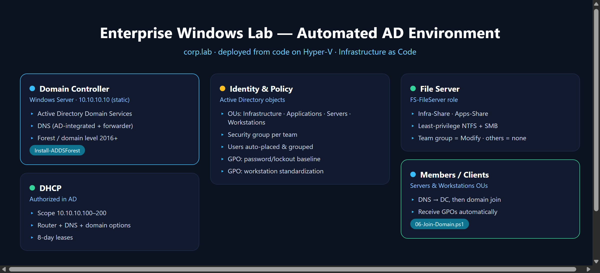

# Enterprise Windows Lab — Automated Active Directory Environment

Deploy a complete, reproducible Windows Server domain — **Active Directory, DNS,
DHCP, Group Policy, and a file server with least-privilege shares** — from code,
in two commands. Built and tested on Hyper-V.


---

## Why this project

Clicking through Server Manager builds a domain **once**. Real infrastructure
work is **repeatable**. This repo treats a Windows domain as code: every role,
OU, user, policy, and share is defined in one config file and applied by
idempotent PowerShell — so the exact same environment can be rebuilt in minutes,
reviewed in Git, and handed to a teammate.

## What it builds

```
corp.lab  (new forest, functional level 2016+)
├── Domain Controller  →  AD DS + DNS (static 10.10.10.10)
├── DHCP               →  scope 10.10.10.100-200, router + DNS options
├── OUs                →  Infrastructure · Applications · Servers · Workstations
├── Security groups    →  Infrastructure · Applications  (users auto-placed)
├── Group Policy       →  password/lockout baseline + workstation standard
└── File Server        →  per-team shares, least-privilege NTFS/SMB
```



## Quick start

> Fresh Windows Server 2019/2022 VM, elevated PowerShell.

```powershell
# 1. Edit the single source of truth
notepad .\config\lab-config.psd1

# 2. Stage 1 — promotes the Domain Controller (auto-reboots)
.\Deploy-Lab.ps1

# 3. After reboot, Stage 2 — DHCP, OUs, users, GPOs, file shares
.\Deploy-Lab.ps1

# 4. Validate (green/red checklist you can screenshot)
.\scripts\Test-Lab.ps1
```

To add a member server or workstation, run `scripts\06-Join-Domain.ps1` **on the
client** — it points DNS at the DC and joins the domain.

## Repository layout

| Path | Purpose |
|------|---------|
| `config/lab-config.psd1` | Single source of truth — edit only this |
| `Deploy-Lab.ps1` | Two-stage orchestrator (handles the reboot) |
| `scripts/01…06` | Focused, re-runnable building blocks |
| `scripts/Test-Lab.ps1` | Post-deploy health check |
| `docs/` | Architecture diagram + deployment guide |

## Design choices

- **One config file.** No values are hard-coded in scripts — change `corp.lab`
  to your own domain once and everything follows.
- **Idempotent.** Re-running never creates duplicates; safe to iterate.
- **Least privilege.** Shares grant Modify to the department group only; NTFS
  inheritance is broken deliberately and rebuilt explicitly.
- **Baseline by default.** 12-char passwords, lockout after 5 attempts, screen
  auto-lock — sane corporate defaults, easy to extend.

## Skills demonstrated

Active Directory · DNS · DHCP · Group Policy · Windows Server administration ·
File services & NTFS/SMB permissions · PowerShell automation · Infrastructure as
Code · Hyper-V lab design.

## Requirements

- Windows Server 2019/2022 (Desktop or Core)
- 2 vCPU / 4 GB RAM for the DC (Hyper-V, VirtualBox, VMware, or Azure VM)
- Elevated PowerShell 5.1+

---

*Built by Saeed Almalki — IT Infrastructure & Systems Engineer.*
